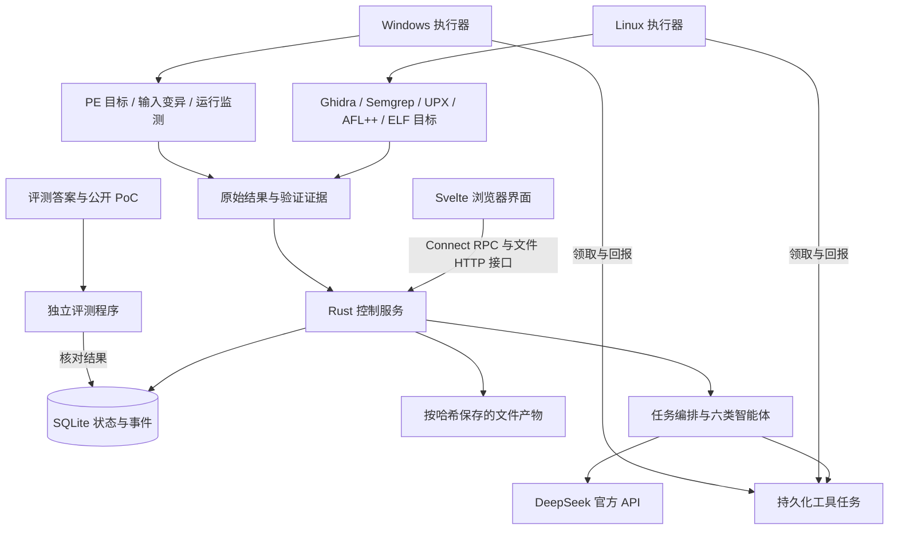

本方案将已确认的项目方向落实为工程模块、数据结构、接口和可检查的实现行为。技术栈确定为 **Rust + Axum/Tokio 后端、Svelte + TypeScript 前端、Connect RPC、SQLite**，Python/Java 仅用于必要的工具适配脚本。全部设计、实现、调试、测试和技术文档由 Codex 承担，不安排时间排期或成员开发分配。

产品目标是在声明的支持范围内，对未专项适配过的源码或二进制自主开展漏洞挖掘、复核和利用验证。历史漏洞提供评测答案，不进入产品的项目专用检测分支。本方案描述完整工程目标；0.1.0 已实现的结构分析链路和剩余工作以[首轮交付记录](首轮交付记录.md)为准，不将设计条目等同于已完成的漏洞能力。

课程需求编号 R01—R15 及用户约束 U01—U06 以[项目方案](选题一可行性分析与初步方案.md)为准；本文件作为具体实现的主要依据，[开发实施计划](开发实施计划.md)只记录依赖顺序，[测试与验收方案](测试与验收方案.md)管理评测。

首批实现范围明确如下。能力只有经过对应测试后才写入软件的已支持清单。

| 对象 | 首批实现范围 | 处理边界 |
| --- | --- | --- |
| 源码 | Python、Go、C/C++；目录快照、ZIP 和指定版本的 Git 仓库导入 | 按语言适配器登记解析质量；动态调用、宏和复杂类型无法解析时保留未知 |
| 二进制 | Windows PE x86/x64、Linux ELF x86_64 | Mac ARM 用于开发；正式 x86/x64 目标在匹配执行环境中运行 |
| 加壳 | UPX 支持格式的识别、验证与解包 | 强商业壳、自修改保护等没有适配时返回不支持，不能伪装成已处理 |
| 混淆 | 固定规则的字符串编码恢复、可证明的简单不透明谓词化简 | 适配器按混淆模式工作；复杂控制流平坦化、虚拟化混淆需另行适配 |
| 漏洞类型 | 注入、路径遍历、认证/授权缺陷、内存越界（越界读/写）；已确定为首版范围，能力待实现 | 依据输入、防护、路径和运行行为判断，不能只按函数名或版本号定性 |
| 关键逻辑 | 认证、加解密、注册 | 这是独立标注能力，不要求每个相关函数都存在漏洞 |
| 动态入口 | 命令行、标准输入、文件及可配置的 HTTP 接口 | 允许正常运行配置和输入适配，不要求用户给出漏洞函数或利用输入 |

范围限定用于明确实现边界，不能减少课程要求的两种开源大模型软件、两种加壳闭源软件、两种混淆闭源软件。正式对象必须与能力范围相匹配；目前六项正式对象尚未全部落实。

已复核课程 PDF 第 2 页：原文未规定必选漏洞类型、类型数量或全类型覆盖。依用户的条件授权，上述四类正式确定为首版范围。认证、加解密和注册仍须作为关键逻辑自动标定；漏洞类型的选择不能代替该能力，也不能抵扣正式软件测试条目。

整体采用一个控制服务和同一套执行器程序，不引入微服务集群、消息中间件或独立向量数据库。Windows 主机运行控制服务，WSL2/Linux 虚拟机和 Windows 测试虚拟机分别运行执行器。执行器主动领取任务，减少对虚拟机入站连接的依赖。



Windows 主机由用户确认为 Windows 11 专业版、i9-13900HX、32 GB 内存、500 GB 硬盘；具体系统构建号、虚拟化、磁盘余量和工具安装仍需实际检查。Mac 经检查为 ARM、16 GB 内存。最终交付让 Windows 主机及其虚拟环境独立运行，Mac 不成为现场演示依赖。

控制服务向浏览器提供界面、业务 RPC、文件接口和进度。执行器承担构建、解析工具、目标运行与证据采集，目标程序不在控制服务进程内执行。Linux 侧优先承担源码扫描、Ghidra 分析和 ELF 模糊测试；历史 Windows 程序放入可重置的 Windows 虚拟机。控制服务持有模型密钥，执行器只获得当前任务所需文件与受限任务凭据。

工程按以下结构建立。各部分是代码边界，不是人员分工。

```text
project/
  Cargo.toml
  crates/
    domain/src/          # 对象、标识、状态规则、证据约束
    application/src/     # 编排、智能体、程序理解、分析服务与接口抽象
    protocol/            # Protobuf 生成与协议类型
    server/src/          # Axum/Connect、模型 API、数据库、产物与配置
    executor/src/        # 工具注册、领取任务、平台执行、日志与产物回收
  proto/audit/v1/        # 项目、任务、分析、报告、执行器服务定义
  frontend/src/          # Svelte 页面、API 客户端、状态与展示组件
  tools/ghidra/          # 无界面导出及 P-code/控制流处理脚本
  tools/adapters/        # 必要的 Python 等工具桥接
  rules/                 # 静态规则、通用语义规则、保护特征规则
  migrations/            # SQLite 版本化迁移
  tests/                 # 领域、接口和工具集成测试
  evaluation/            # 案例目录、参考答案、评测程序与结果
```

domain 不依赖模型、HTTP 或数据库。application 通过 ModelClient、ToolExecutor、ArtifactStore、RunRepository 等接口访问外部能力。server 负责组合实现；executor 复用协议和领域类型，不直接读写 SQLite。评测参考文件不进入产品任务目录或智能体文件工具的可读范围。

依赖选择如下，具体兼容版本通过最小运行检验后写入 Cargo.lock、前端锁文件和工具清单。

| 能力 | 实现选择 |
| --- | --- |
| HTTP、异步与 RPC | Axum、Tokio、官方 connect-rust 与 connect-es；Connect Rust v0.9.0 为已核查起点，最低 Rust 以选定版本要求为准 |
| 序列化、模型调用 | Serde/serde_json、reqwest；通过适配器处理实际模型服务协议 |
| 存储 | SQLx + SQLite，开启外键、WAL，使用版本化迁移 |
| 文件与标识 | UUID、SHA-256、独立产物目录；路径、文件量和解压大小有边界检查 |
| 程序理解 | Tree-sitter 及各语言语法库、object 二进制格式读取、Ghidra 脚本 |
| 界面 | Svelte、TypeScript、Vite；Monaco 展示代码，Cytoscape.js 展示局部调用/控制流图 |
| 报告 | 固定结构 JSON、转义后的 HTML 模板及 Markdown 导出 |

Svelte 构建后的静态文件由 Rust 提供，正式部署不需要另外运行前端 Node 服务。Rust 主程序仍依赖实际使用的 Ghidra/JDK、扫描器和执行环境，不能把一个可执行文件等同于完整分析环境。

核心数据对象先固定语义，再实现数据库和 Protobuf 映射。

| 对象 | 关键字段与约束 |
| --- | --- |
| Project | id、名称、目标类型、导入来源；一次导入产生不可变 Snapshot |
| Snapshot | id、project_id、目标哈希、版本/提交、文件清单、平台、可选的初始运行配置产物引用、导入状态；就绪后内容不可修改 |
| Artifact | id、sha256、大小、类型、存储位置、来源任务、parent_artifact_id、转换说明 |
| ProgramUnit | id、snapshot_id、语言、函数/模块名、代码产物、位置、解析质量、输入及操作摘要 |
| ProgramEdge | from、to、关系类型、调用点/分支条件、证据引用、确定/推断/未知标志 |
| LogicAnnotation | 认证/加解密/注册标签、函数引用、依据、置信度、人工修订版本 |
| AuditRun | id、snapshot_id、分析配置、运行配置版本记录、预算、模型/规则/工具版本、状态、覆盖与错误摘要 |
| WorkItem / ToolRun | snapshot_id、可选 run_id、依赖、角色、工具及参数、attempt_id、租约、退出状态、日志和产物引用；导入任务可先于 AuditRun 创建 |
| ModelCall | work_item_id、角色、服务/模型、提示词版本、上下文与响应产物、用量、停止或错误原因 |
| FuzzSession | tool_run_id、目标/构建、种子与语料产物、变异设置、执行统计、覆盖模式及异常引用 |
| Finding | id、run_id、CWE、位置、可控输入、危险操作、防护缺口、触发条件、严重度依据、证据引用 |
| Review | finding_id、复核主体、原始依据、结论、反证、修订历史 |
| VerificationRun | finding_id、目标/构建哈希、环境、验证范围、输入/利用代码、判据、执行和观察结果 |
| RunEvent / Report | run_id、事件序号/导出版本、来源记录与产物引用 |

源码位置保存相对路径、行号和字节范围。二进制位置保存原始文件、分析产物、模块、函数地址/RVA 及伪代码范围。解包前后地址不能直接对应时，仅记录产物转换关系和各自地址，不伪造一一映射。地址在界面接口中使用十六进制字符串，事件序号使用生成客户端支持的 64 位整数类型。

SQLite 建立 projects、snapshots、artifacts、program_units、program_edges、logic_annotations、audit_runs、work_items、tool_runs、model_calls、fuzz_sessions、findings、reviews、verification_runs、run_events、executors 和 report_exports 表。结构化扩展字段可存 JSON，状态、外键、哈希和查询字段使用独立列。仅控制服务写数据库，执行器通过接口回报。

状态变化与对应事件在同一个数据库事务中提交。run_events 对 run_id 和 seq 建立唯一约束；任务创建对客户端 request_id 去重。文件先写临时区并校验哈希，再原子归档，数据库只引用已完成的产物。界面事件通知只是唤醒信号，事件补读始终从数据库序号开始，避免重连时遗漏。

任务状态与漏洞结论分开管理。

| 状态对象 | 状态与规则 |
| --- | --- |
| AuditRun | QUEUED、RUNNING、WAITING_INPUT、WAITING_EXECUTOR、CANCELLING、COMPLETED、PARTIAL、FAILED、CANCELLED、LIMIT_REACHED |
| 复核结论 | UNREVIEWED、VALIDATED、REJECTED、INCONCLUSIVE；VALIDATED 仅表示复核依据成立 |
| 验证结果 | NOT_RUN、RUNNING、REPRODUCED、EXPLOIT_CONFIRMED、NOT_REPRODUCED、INCONCLUSIVE、ERROR、CANCELLED、LIMIT_REACHED |
| 验证范围 | COMPONENT 或 FULL_TARGET；另记 ORIGINAL_BINARY、SOURCE_BUILD、INSTRUMENTED_BUILD、MOCK 等目标变体 |

COMPLETED 表示声明的分析工作结束，不表示目标安全。部分必需步骤不支持或失败时保留 PARTIAL 及覆盖缺口。模型置信度不能将验证结果升级为 EXPLOIT_CONFIRMED；人工备注也不能改写原始执行证据。复核驳回和未复现具有不同含义。

工具任务使用 attempt_id 和执行租约。执行器回报时校验当前租约，重复提交只记一次，过期尝试的结果保留为历史且不覆盖新状态。断线后先核实旧尝试是否结束；结果不明的目标环境需终止或重置后才能重试，避免对同一目标并行重复执行利用。执行器本身执行资源限制并回收子进程，不单靠控制服务保持连接。

取消分析使用显式 CancelRun。浏览器关闭或进度流断开只停止订阅，后台任务继续保存结果。收到取消后进入 CANCELLING，回收任务相关进程并记录确认结果，再进入 CANCELLED；不能在远端程序仍运行时直接显示已取消。

导入模块先创建状态为 IMPORTING 的 Snapshot，再调度文件检查和解析准备。成功后冻结清单与哈希并转为 READY；只有部分内容可用时为 PARTIAL，无法形成有效输入时为 FAILED。PARTIAL 快照可以在用户声明的可分析范围内启动任务，导入缺口随任务和报告保存。更换文件或提交产生新快照。正常构建/运行配置保存为不可变的产物版本，补充配置时追加版本，由相关 ToolRun 和 VerificationRun 固定引用；同一源码因构建配置不同产生的程序分别保存哈希及构建信息，不能覆盖旧证据所引用的目标。

| 导入输入 | 具体处理 | 保存结果 |
| --- | --- | --- |
| 源码目录或 ZIP | 浏览器选择目录后按相对路径打包上传；校验文件数、单文件大小、总解压大小和路径；拒绝越界、符号链接及路径归一化后的冲突 | 文件清单、各文件哈希、排除项及原因；默认不携带 .git 历史 |
| Git 仓库 | 执行器获取指定提交；分支或标签先解析并记录提交哈希；不自动执行仓库脚本、hook 或递归拉取子模块 | 仓库来源、提交、源码快照；实际缺少的子模块及依赖 |
| PE/ELF 文件 | 用文件头和 object 库识别格式、架构、节区、导入/导出及入口信息；扩展名仅作提示 | 原始二进制、识别结果、分析所需平台与候选保护特征 |

源码默认排除依赖缓存、构建目录和版本库元数据，用户可调整范围。排除清单进入覆盖报告，不能把未审计内容计为已审计。二进制的所有转换都生成新 Artifact，原件保留。导入不会在控制服务主机上构建或启动目标。

程序理解模块把源码和二进制分别解析，再通过 ProgramUnit、ProgramEdge 和证据引用供审计使用。统一的是查询和证据格式，不把伪代码当作可以直接编译的 C，也不把源码语法树当作完整的程序语义。

| 模块 | 首批实现方式 | 正确性边界 |
| --- | --- | --- |
| 源码结构 | Tree-sitter 按 Python、Go、C/C++ 提取模块、函数、参数、调用点、条件和返回值；建立路径及符号索引 | 区分已解析、部分解析和失败；错误节点及宏展开缺口有记录 |
| 调用与局部控制流 | 建立函数内基本块及分支边，按语言规则解析直接调用；保存入口到危险操作的相关片段 | 动态分派、函数指针、反射和无法解析的跨模块调用标记为推断或未知 |
| 函数摘要 | 保存外部输入、危险操作、防护条件、重要数据变换及对应位置；模型摘要必须引用代码或工具产物 | 摘要为检索和审计提供线索，不能代替原始代码证据 |
| 二进制导出 | Ghidra headless Java 脚本导出函数、反编译文本、调用/交叉引用、基本块、P-code、字符串和导入符号，输出版本化 JSON | 反编译失败按函数保存；伪代码与指令只能在工具提供映射的位置关联 |
| 查询与检索 | SQLite 保存索引，按符号、路径、文本及图邻接查询；模型通过读函数、读文件片段、查调用者/被调用者逐步补充上下文 | 初期不需要向量数据库；截断的文本与尚未展开的图节点明确返回 |

关键逻辑标定与漏洞发现分别存储。认证标定检查身份输入、校验及会话/访问控制关系；加解密标定检查算法调用、密钥/随机数处理及数据流；注册标定区分账户创建、许可证激活、组件注册等语义并记录子类型。名字或字符串只用来定位候选，最终标签需有代码、控制流或调用依据。人工修正保存修订版本，报告同时保留原始依据。

二进制保护处理采用“特征收集—智能体选择适配器—工具执行—结果检查”的有限循环，每次决定和工具结果单独保存。模型只能选择已注册能力；识别为未知保护时保留原始分析结果与限制。

| 保护情况 | 实现方式 | 处理成功的依据 |
| --- | --- | --- |
| UPX | 综合节区、入口、签名及 UPX 检测结果生成候选；调用 UPX 检查和解包，再解析产物 | 真实命令与退出结果、产物哈希、格式/架构复核及重新反编译结果；仅有签名命中不算成功 |
| 固定字符串编码 | 在指令/P-code 中识别受支持的常量异或、固定加减等解码模式，对可求值片段恢复字符串并关联使用点 | 编码字节、算法参数、解码结果及使用地址可核对；无法确定的密钥或运行状态保持未知 |
| 简单不透明谓词 | 对无外部副作用、输入范围明确的位运算/常量分支，按位宽和溢出语义证明条件恒定，在派生分析视图中化简 | 保存原始块、表达式、证明依据及化简后的边；仅凭模型判断不删除分支 |
| 其他保护 | 保存特征、尝试记录及所需适配能力，允许继续分析仍可读的部分 | 明确为部分处理或不支持；不把函数重命名视为解混淆 |

字符串恢复必须进入后续引用和语义分析，控制流化简必须形成可查询的派生图及可读表示；只在日志打印结果不能满足 R03。优先改变分析视图，避免为改善展示直接修改可执行文件。需要运行验证时使用原始目标或明确标注的转换产物。处理前后可读函数数量、解码字符串及图变化用于说明效果，不能单独证明漏洞已经检出。

六类智能体以独立上下文和结构化任务实现，共用 ModelClient，不要求同时调用六个模型。调度器保存依赖、预算和状态；模型负责提出分析决策，不能自行改写任务成功状态、工具权限或资源上限。

| 角色 | 输入与可用能力 | 必须交付的结果 |
| --- | --- | --- |
| 编排 | 目标摘要、能力清单、未完成任务和预算；提交、拆解及重新安排工作项 | 含依赖、目标、所需工具和停止条件的分析计划；选择下一步的简明依据 |
| 导入与逆向 | 文件元数据、保护特征、解析及处理工具 | 模块/函数索引、保护处理决策、转换产物及解析缺口 |
| 审计 | 源码/伪代码、调用与控制流查询、静态线索、动态异常 | 漏洞假设、关键逻辑标签、证据引用、缺少的条件和建议检验方式 |
| 独立复核 | 候选陈述、原始代码和工具结果；可重新检索与请求受限复测 | VALIDATED、REJECTED 或 INCONCLUSIVE，及支持依据、反证和待补信息 |
| 验证与利用 | 复核结果、正常运行配置、目标环境、输入及运行工具 | 测试/利用产物、适用前提、成功判据、真实运行记录及失败原因 |
| 报告 | 已持久化的发现、复核、验证、人工修订和覆盖数据 | 固定结构报告及面向读者的解释、修复建议；引用已有证据 |

每轮遵循“读取限定上下文—请求结构化操作—校验—执行—保存结果”的约定。动作包含类型、对象、参数、证据引用和简短依据；原始响应、解析结果及用量按调用保存，不要求模型暴露内部思考过程。提示词按角色和版本管理，目标文本始终作为分析材料传入。

独立复核不会继承审计角色的整段对话或将其置信度视为事实，而是重新查看原始输入、防护条件和可达路径。同一模型仍可能重复同类错误，因此独立上下文只是复核措施之一，必须结合修复对照、真实执行和证据校验。复核可请求补充一次工作项，但不能无限循环；预算用尽后保留不确定结论。

ModelClient 接受角色消息、工具描述、输出 schema、超时和预算，返回正文、结构化操作、停止原因、提供方用量和调用标识。用户已确定使用 DeepSeek 官方 API，首版按此前偏好优先适配 deepseek-v4-flash。配置包含服务地址、API 协议类型、模型标识及密钥环境变量名；GLM 保留为历史备选，不作为首版必须接入的服务。

用户不设 API 费用总额上限，API 接入与适配细节由 Codex 自主处理，后续不再作为访谈问题。费用上限为可选配置，当前不启用；保留用量和费用统计。工具超时、资源限制和分析停止条件独立于费用上限，用于控制任务生命周期。

2026-09-07 核对 [DeepSeek 官方接口文档](https://api-docs.deepseek.com/)：支持 OpenAI 兼容 API，官方基址为 `https://api.deepseek.com`，聊天端点为 `/chat/completions`，文档列有 `deepseek-v4-flash`。Rust 适配器采用 reqwest 直接请求该接口，密钥从 `DEEPSEEK_API_KEY` 等本地配置引用读取。实际工具调用、结构化输出、流式响应、用量和限流行为仍需真实请求验证。模型别名可能随官方更新指向新版本；任务记录配置标识、返回的模型/版本信息（若提供）及调用日期，不把别名等同于固定模型版本。

优先使用服务支持的工具调用与结构化输出；若端点不支持，则采用受 schema 校验的 JSON 操作协议。格式修正、限流和临时服务错误均设有限重试，参数错误或鉴权失败直接记录。工具清单、上下文长度、并行限制和用量字段按所选官方模型及模式核实。调用完成后记录实际用量；没有实际用量时标记为估算，不能显示为零消耗。仅在启用费用上限时执行调用前的额度预留与调用后的结算，当前配置不因金额上限停止任务。密钥不进入模型提示词、执行器参数或导出报告。

审计实现由静态线索、自主语义检查和动态反馈共同驱动，不能只把 Semgrep 告警交给模型润色。

| 能力 | 实现决策 | Finding 的最低依据 |
| --- | --- | --- |
| 静态扫描 | Semgrep CE 输出统一转换为线索，保存规则版本、原始 JSON 和位置；工具适用性按语言报告 | 命中内容和原始位置；规则命中本身不自动成为已确认漏洞 |
| 自主语义审计 | 按外部入口、权限边界、危险操作和关键逻辑选取函数，即使没有告警也安排审计 | 输入是否可控、操作是否危险、防护及触发条件、相关代码/地址 |
| 跨函数检查 | 沿调用图请求相关函数，整理参数传递与防护摘要；有限深度和节点预算内扩展 | 逐段引用已知调用点与条件；无法连接的路径明确为待证假设 |
| 候选合并 | 按快照、位置、危险操作与疑似根因建立指纹，合并重复线索并保留全部来源 | 同类 CWE 不能单独作为合并依据，避免吞掉不同缺陷 |
| 独立复核 | 检查边界、前置条件、净化/校验、调用可达性及相反证据 | 复核结论及引用；缺信息时为 INCONCLUSIVE |

四类首批漏洞分别关注：注入中的输入到解释/执行边界；路径遍历中的路径组合、规范化和目录约束；认证/授权中的主体、资源及检查支配关系；内存问题中的长度、索引、分配和访问范围。初期的跨过程分析采用有限的摘要与模型核查，不宣称实现完备的全程序污点分析或符号执行。

每条 Finding 保存 CWE（允许未知）、严重等级及理由、位置、输入来源、危险操作、防护缺口、触发前提和 EvidenceRef 列表。EvidenceRef 至少指向 Artifact 与其范围/定位信息，并关联产生它的 ToolRun 或模型调用。模型给出的行号、地址和引用先由服务核对；不存在的引用拒绝入库，证据不足的候选保留为待复核。严重等级可为 UNKNOWN，不凭模型置信度推导；缺少部署条件时不编造精确 CVSS 分值。

所有外部分析能力通过统一工具适配器接入。工具清单记录名称、版本、输入/输出 schema、支持的平台与目标类型、所需资源、允许的产物及是否运行目标；缺失能力返回 UNSUPPORTED，不用空结果代替。

| 工具组 | 请求示例 | 返回内容 |
| --- | --- | --- |
| 查询 | read_unit、read_span、search_code、query_graph | 有长度上限的文本、图数据、定位及截断标记 |
| 导入与理解 | inspect_target、parse_source、decompile_binary | 格式/结构结果、解析质量、日志与产物 |
| 保护处理 | detect_protection、unpack_upx、simplify_pattern | 特征、所选模式、前后产物及有效性检查 |
| 静态审计 | scan_rules、collect_context | 原始扫描结果、标准化线索及相关位置 |
| 动态执行 | build_target、run_target、fuzz_target、replay_input、run_verification | 实际环境、退出/终止原因、观察数据、输入及日志 |

以上名称为完整产品的规划工具接口；本轮已实现导入、Tree-sitter 与 Ghidra 结构解析的执行桥接，模型智能体工具注册与其他审计/利用工具仍待实现。进程适配器用可执行文件与参数数组启动程序，不把模型字符串直接拼接为 shell 命令。需要生成的测试代码先作为 Artifact 保存，再交给目标环境运行；执行器校验参数、工作目录、产物范围及资源约束。stdout/stderr 限量实时回传，完整日志按配额保存，截断必须有标记。

执行器注册 OS、架构、工具版本、可执行目标架构、资源限制能力和空闲槽位。控制服务按实际能力分配任务；装有某工具不等于它能执行任意架构目标。一个目标环境同一时刻只运行一项会改变其状态的任务，分析和验证前恢复约定基线。

Windows 使用 Job Object 回收目标进程树；Linux 使用进程组并在可用的容器/cgroup 中限制资源。虚拟机提供目标环境隔离，进程组本身不能替代隔离。子进程仅获得当前工作目录、运行所需环境变量和目标网络范围；执行器凭据由监督进程保管。租约失效后由执行器停止任务并确认回收；重新上线先报告旧尝试状态，再领取新任务。

动态测试使用统一 TargetRunSpec 描述正常运行方式：目标/构建产物、参数数组、相对工作目录、必要环境变量、输入类型、就绪探针、单次超时、资源上限及状态重置方式。CLI、stdin、文件和 HTTP 适配器只描述如何输入和观察目标，不携带漏洞函数、CVE 或参考利用输入。HTTP 目标绑定执行环境中的已登记服务地址，构建与启动均在执行器中进行。

用户已确认采用“自动识别优先，确实缺少信息时补充正常运行配置”。系统先读取构建文件、项目说明和入口信息，生成配置候选，经参数及执行范围校验后，在执行器中尝试构建、启动及正常输入检查。信息不足时只请求缺少的字段，并尽量提供候选命令及识别依据；不要求用户预先指出漏洞位置、触发条件或利用输入。成功配置保存为版本化产物，后续分析可复用，并在目标版本或环境变化时重新检查。

缺少运行信息时，相关动态工作项进入 WAITING_INPUT，界面列出缺项；源码静态审计等不依赖这些信息的工作继续进行。任务仍有可运行工作时保持 RUNNING，剩余工作均被输入阻塞时才进入 WAITING_INPUT。补充配置后重新校验并继续相关工作，不覆盖先前尝试或把等待计作已完成验证；用户选择跳过动态环节时，最终报告保留 PARTIAL 与覆盖缺口。

| 动态方式 | 首批实现 | 记录与限制 |
| --- | --- | --- |
| 有源码且可插桩的 Linux 目标 | 在适用构建上使用 AFL++，对 C/C++ 可结合 Sanitizer；从正常输入形成种子，变异并收集异常 | 编译参数、插桩方式、覆盖反馈、执行数、异常和最小化输入；插桩构建与原始目标分开记录 |
| 满足条件的 Linux 二进制 | 检查 AFL++ 相应执行模式与目标架构；可运行时接入，否则使用统一输入变异器 | 记录是否确有覆盖反馈，不把所有 AFL++ 模式或所有 ELF 都列为已支持 |
| Windows PE、服务及其他无覆盖反馈入口 | 对文件、参数或请求按格式进行输入变异，监测异常、超时与目标行为 | 明确标为无覆盖反馈的动态测试；WinAFL/TinyInst 留作按样本需要扩展 |

模糊测试不能只执行公开 PoC。运行器必须产生或变异输入并真实执行，保存种子、变异配置、次数、去重依据和原始异常。异常先复测并尽可能最小化，再关联代码路径和具体根因；基于栈/地址/异常类别去重，不能把多次同一崩溃计为多个漏洞。超时、服务不可用与目标缺陷分别记录。

自动利用模块接收复核通过的候选，基于系统已有分析构造测试或利用程序，保存为独立产物并在匹配环境执行。支持范围内按漏洞原理复用输入生成、协议交互及观察模块，不用目标名或 CVE 选择预制答案。运行条件不足时输出可执行产物、缺少的条件和未验证状态，不能提前报告成功。

| 对象 | 可接受的观察依据 | 不能据此推出的结论 |
| --- | --- | --- |
| 注入类影响 | 在测试目标内产生事先定义的无害标记或受控计算结果，和正常输入结果对照 | 测试脚本自行打印标记不能证明目标执行了输入 |
| 路径/访问控制缺陷 | 由观察器确认受控测试文件的越界读写，或测试身份访问了本应禁止的测试资源 | 单独 HTTP 200、页面文字或脚本退出码不能证明影响 |
| 内存边界缺陷 | 可重复异常、Sanitizer/调试记录、关联访问位置和输入 | 崩溃只能证明对应异常；没有额外证据不能宣称任意代码执行 |

验证开始前固定目标哈希、变体、验证范围、输入产物、预期影响和可机器检查的判据。服务从已支持的观察器类型中校验判据，由执行器监督进程采集结果，生成的利用代码不能自行设置 verdict。每次 VerificationRun 单独保存，重试不能覆盖失败记录。达到具体缺陷的影响判据后才可标记 EXPLOIT_CONFIRMED，并在报告中写明到底证实了什么影响。

COMPONENT、MOCK、INSTRUMENTED_BUILD 的结果保留其适用范围；正式软件的整体挖掘与利用验收需要相应真实目标和入口上的证据。环境有效且指定输入未触发预期行为时为 NOT_REPRODUCED；结果有歧义时为 INCONCLUSIVE；构建、启动或工具故障为 ERROR。相同生成产物在修复版或正常对照上执行可辅助判断根因，修复信息仍由评测侧掌握。

业务接口按 `audit.v1` 定义 Protobuf 服务，使用官方 Rust/TypeScript 工具链生成协议代码。domain 使用自己的类型，通过明确的转换进入 RPC；数据库行和模型响应不直接作为接口消息。协议中的枚举保留 UNSPECIFIED，移除字段保留编号，不能复用旧编号表达新含义。

| 服务 | 拟实现的方法 | 请求和结果约定 |
| --- | --- | --- |
| ProjectService | CreateProject、ListProjects、GetProject、CreateSnapshot、GetSnapshot | CreateSnapshot 接收上传产物或 Git 地址/版本及可选的正常运行配置，返回快照标识和导入状态；通过 GetSnapshot 查询进度与失败原因 |
| RunService | CreateRun、ListRuns、GetRun、WatchRun、ProvideRunConfiguration、CancelRun | CreateRun 固定快照、分析范围、模型配置版本和预算；WatchRun 接收 run_id、after_seq；ProvideRunConfiguration 幂等追加配置版本并恢复待配置工作；CancelRun 返回当前取消状态 |
| ProgramService | ListUnits、GetUnit、GetGraph、ListAnnotations、UpdateAnnotation | 代码按范围读取，图按中心节点和深度查询；人工标注携带 expected_revision，返回新修订 |
| FindingService | ListFindings、GetFinding、SubmitReview、RequestVerification | 人工复核与机器记录并列保存；RequestVerification 创建新的验证记录，不直接写入成功结果 |
| ReportService | CreateReport、GetReport | 接收任务、导出格式和报告配置，返回导出状态、所依据的版本及产物标识 |
| ExecutorService | Register、Heartbeat、ClaimWork、ReportProgress、CompleteWork | 独立执行器身份；任务回报携带 work_item_id、attempt_id 和租约凭据；心跳返回取消/终止指令 |
| SystemService | GetCapabilities、GetSettings、CheckModel | 返回实际工具/环境能力和脱敏配置；CheckModel 进行有用量记录的实际连通及协议检查 |

创建项目、快照、任务、验证和报告等会产生新对象的请求携带 request_id，同一身份与方法下重复提交返回原对象；同一 request_id 对应不同内容时返回冲突。人工修订携带 expected_revision，过期修订不能静默覆盖新结果。列表使用分页游标及稳定排序，过滤项包括任务、语言、严重度、复核和验证状态。

接口错误使用 Connect 标准错误码，并携带可读原因和可选的工作项引用。参数错误为 invalid_argument；目标/工具前置条件不满足为 failed_precondition；资源或预算不足为 resource_exhausted；修订冲突为 aborted；临时不可用为 unavailable。执行器故障会持久化为任务结果和事件，不能仅表现为一次 HTTP 请求失败。

进度事件包含 run_id、seq、时间、类型、工作项及相关对象标识，类型至少涵盖状态变化、工具开始/结束、模型用量、发现/复核/验证更新和错误。WatchRun 先从数据库补读 `seq > after_seq` 的事件，再等待新事件；通知丢失时仍可补查数据库。客户端按 seq 去重，心跳不冒充业务事件。任务结束后传完已有事件再关闭流；取消订阅仅停止传输。

文件传输使用同一 Axum 服务上的 HTTP 接口：`POST /api/uploads` 接收有大小上限的文件流，完成哈希检查后返回上传产物标识；`GET /api/artifacts/{id}` 在鉴权后下载或按范围读取产物。RPC 只携带产物引用。上传的引用绑定当前身份及后续项目，执行器产物绑定任务和租约；客户端不能通过传入任意主机路径读取文件，也不能提交其他任务的产物充当证据。

用户已确认单人使用、无需共享。首版使用一个操作员会话，不实现多用户账号注册、成员管理、项目共享或角色权限分配；执行器使用独立身份。单人仍可提交多个分析任务，任务队列及资源上限继续生效。控制服务默认仅本机访问；虚拟机执行器连接时显式配置可达地址及通信保护。浏览器会话与执行器令牌分别校验，配置接口不返回密钥。模型文件查询只开放当前目标及授权的本次分析产物；评测参考、主机目录、其他项目及执行器控制凭据不进入查询范围。

Svelte 界面通过生成的 Connect 客户端访问服务，按下面的页面组织功能。

| 页面 | 用户能完成的操作 | 展示要求 |
| --- | --- | --- |
| 项目与导入 | 新建项目，选择源码/二进制，查看快照及自动识别结果，按需补充缺少的正常构建/运行配置 | 格式、架构、哈希、导入进度、配置候选及缺项、排除项和不支持原因 |
| 分析任务 | 选择快照与预算，启动/取消分析，查看进度和工具执行 | 当前环节、完成/待处理数量、真实日志、用量、等待或失败原因；未知总量不显示虚构百分比 |
| 程序与关键逻辑 | 查看代码/伪代码、函数、局部图、认证/加解密/注册标注并修正 | Monaco 展示原始位置，Cytoscape 展示局部调用/控制流图；推断关系与已确认关系有明显区别 |
| 漏洞与复核 | 筛选候选，查看输入、触发条件和证据，提交人工复核 | 严重等级、复核结论、验证结果分别显示，证据可跳转到实际产物 |
| 验证记录 | 查看测试/利用代码、目标环境、每次尝试及观察结果 | 明确原始/插桩/局部目标差异，显示成功判据、失败或不确定原因 |
| 报告 | 查看并导出指定任务的报告 | 漏洞、逻辑标注、证据、修复建议、覆盖缺口和人工修订均可追溯 |
| 环境与模型 | 选择已配置模型，检查服务，查看执行器及工具能力 | 实际检查结果、工具版本、平台和可用性；密钥只显示是否配置 |

浏览器刷新后先重新读取任务状态，再从保存的游标订阅；界面不依赖内存中尚未保存的事件。日志限制渲染数量，代码和图按需加载。目标源码、字符串、日志及模型内容按文本显示；Markdown/HTML 报告经过转义和清理，不能作为页面脚本执行。人工编辑失败或发生版本冲突时保留未提交内容并显示原因。

报告以确定性数据装配为主，模型只辅助撰写已有事实的解释和修复建议。导出先固定事件上界、发现/复核修订及产物引用，形成不可变 Report，再生成 JSON、HTML 或 Markdown；运行中的任务可以导出，但必须标记为阶段报告。

| 报告内容 | 数据来源 |
| --- | --- |
| 目标与方法 | 快照哈希、版本、范围、系统/模型/工具/规则版本、预算及实际消耗 |
| 分析覆盖 | 导入/解析/审计函数数量、跳过内容、未知调用、未支持保护与失败步骤 |
| 漏洞列表 | Finding、机器与人工复核、严重等级依据、可控输入、触发前提和修复建议 |
| 证据链 | 原始/转换产物、位置/地址、调用及分支依据、模型/工具记录、验证尝试 |
| 关键逻辑 | 认证、加解密、注册标签、依据及修订记录 |
| 验证结果 | 测试/利用代码、目标与环境、成功判据、实际观察、范围和最终状态 |
| 限制 | 未复现、不确定、错误、资源耗尽、人工辅助及仍需验证的假设 |

导出前检查所有证据引用是否存在并属于目标任务，成功验证是否满足状态规则。报告中的“未发现”只表示声明范围内的结果。人工驳回不删除原始发现，人工标注“认为存在”也不会伪造自动利用记录。

配置和部署围绕控制服务与执行器两个程序提供，分别维护 `config.example.toml` 与 `executor.example.toml`。本轮使用两个可执行文件的 CLI 参数及本地管理脚本配置环境；完整 TOML 配置文件随模型/动态执行能力补齐。已可用脚本见[安装与运行](安装与运行.md)。

| 配置范围 | 必需设置 |
| --- | --- |
| 控制服务 | 监听地址、SQLite/产物目录、会话配置、上传与归档配额、事件及日志策略 |
| 模型 | 提供方协议、base_url、model、密钥环境变量名、上下文/调用/用量限制 |
| 执行器 | 控制服务地址、身份凭据引用、工作区、工具路径、平台、资源/网络约束、并发上限 |
| 分析 | 语言与保护适配器、规则版本、检索与图扩展范围、模型/工具重试次数 |
| 动态测试 | 输入方式、目标就绪/重置、种子、执行/时间/空间预算、观察器及产物配额 |

API 密钥和执行器凭据使用本地环境变量或独立配置保存，示例文件仅写占位符。任务创建时保存脱敏后的配置版本；模型请求、工具日志及导出同样进行敏感字段过滤。任务按配置中的工具超时、资源限制和分析停止条件运行，达到相应限制时停止新增工作、回收执行过程并保留已产生的证据；费用上限未启用时不参与停止判定。

工程提供开发启动、协议生成、检查、发布构建和环境诊断脚本。首次实现固定 Rust、Node LTS、pnpm、Protobuf/Connect 生成器及工具版本，保存 Cargo.lock 和 pnpm-lock.yaml。Windows 控制服务/执行器在匹配的 Windows 构建环境产出，Linux 执行器单独构建；不假定 Mac 交叉编译能直接替代最终环境验证。

发行包包含 Rust 程序、Svelte 静态资源、数据库迁移、规则、工具脚本、配置示例和安装说明。外部 Ghidra/JDK、UPX、Semgrep、AFL++ 及目标镜像按版本清单准备，不把未安装依赖记为已具备能力。备份需覆盖 SQLite 一致性快照、报告及引用产物；不能只复制正在使用的 SQLite 主文件而遗漏 WAL 内容。最终在 Windows 及其虚拟环境按文档重新安装运行。

评测程序保持在 `evaluation/`，只在分析结束后读取产品结果并与参考答案核对。案例配置分为可供产品使用的 `target.json` 和仅评测可见的 `reference.json`：前者含目标、哈希及正常运行接口，后者含已知缺陷、补丁、参考 PoC 和判分依据。产品部署包不包含 reference 文件，执行器的可读工作区也不包含评测目录。中性编号降低直接暴露答案的风险，公开模型可能已知道历史漏洞这一限制仍需报告。

正式软件条目继续使用 S1/S2、P1/P2、O1/O2。用户确认老师无额外解释，按 PDF 原文筛选，由 Codex 核查软件类别及测试依据。S1/S2 优先从原文列举的 DeepSeek、智谱、Kimi 官方开源大模型软件中选择两个不同项目；这属于保守的样本选择策略，不是新增品牌限制。llama-cpp-python 和 Ollama 暂作为开发回归候选，不占据正式条目。四个闭源软件条目继续核查真实闭源发布物的加壳或混淆特征。全部正式候选均需落实来源、开源/闭源属性、版本、保护方式、可运行入口及漏洞依据，现阶段六项仍未确定为合格样本。

样本选定后检验通用适配器是否能处理，能力不足时扩展相应语言、保护方式或执行适配，不为通过某个案例新增项目名/CVE 专用检测分支。正式验收必须保留原文所要求的软件类别、数量以及挖掘和利用证据；运行通用推理框架、仅分析模型权重、导入成功或完成一次扫描均不能自动抵扣这些要求。

小型可控程序用于检查接口、状态、处理算法和执行器；正式挖掘效果由真实软件、修复/正常对照及保留案例检验。1—2 个复杂案例用于检查跨模块路径或较复杂的动态验证，不能抵扣 R14 的类别与数量。已用于调试的案例如实标记，不能继续称为未见测试。

以下为编码时必须建立的验收对应关系；其中的测试与产物均待真实运行生成。

| 需求 | 对应实现 | 验收证据 |
| --- | --- | --- |
| R01 | 编排器、六类角色、ModelCall 与 WorkItem | 独立上下文、工具请求、结果交接、有限重试和用量记录 |
| R02 | 导入器、快照、源码解析、二进制识别 | 不同目标的清单/哈希、模块函数、位置、错误与缺口 |
| R03 | 保护规划、UPX、模式解混淆、Ghidra | 多个样本的特征、处理决策、真实工具记录、前后产物与可读结果 |
| R04 | 共用 ProgramUnit 和审计接口 | 源码与反编译结果均产生有依据候选，原始位置/地址可回溯 |
| R05 | 语义摘要、调用/控制流、关键逻辑标定 | 三类逻辑、关联代码、路径与人工修订；未知关系如实显示 |
| R06 | 静态扫描、自主语义审计 | 规则及模型的代码依据；规则无告警时的自主检查记录 |
| R07 | AFL++、输入变异、运行监测、复测 | 种子、真实执行、覆盖模式、异常去重和复测结果 |
| R08 | 独立复核和反证检查 | 真实缺陷、修复及正常对照上的保留/驳回/不确定结论 |
| R09 | 自动生成/适配并运行利用产物 | 实际目标、可执行利用代码、判据、观察结果及证实的具体影响 |
| R10 | EvidenceRef、Artifact、VerificationRun | 每个结论可回溯至代码位置、路径、输入、环境和运行产物 |
| R11 | 人工复核与标注修订 | 保存后刷新、冲突处理、历史保留及导出一致 |
| R12 | Connect 进度、Svelte 界面、确定性报告 | 实时/重连结果正确，报告含漏洞、严重度、证据和修复建议 |
| R13 | 开源来源记录及实际对照评测 | 与 DeepAudit 等系统在可比任务上的结果、自研部分及差异说明 |
| R14 | 六个正式条目及独立评测程序 | 软件类别与数量成立，每项有真实挖掘和利用记录 |
| R15 | 打包、安装说明及课程交付材料 | Windows 干净部署、源码/文档/PPT/录像及真实贡献记录 |

优先验证影响结论正确性的行为：产物/位置引用无误；没有执行证据不能进入利用成功；模型伪造引用会被拒绝；过期租约不能覆盖新结果；重复请求不会重复创建任务；取消后目标进程确已结束；服务重启后从持久化状态恢复；浏览器断线能补读；工具失败不会被当作无漏洞；产品无法读取评测答案。这些检查与实际源码/二进制案例一同推进，不靠大量镜像实现细节的测试代替。

U01 用不同项目和同类缺陷的不同实现检验；U02 保存工具/源码的来源、版本、许可证、借鉴范围及实际改动；U03 记录所选 API 的真实调用；U04 保留历史依据及简单/复杂案例结果；U05 记录回归与保留集合使用情况；U06 由 Codex 承担全部实现及技术文档，不设置日期排期或成员开发任务。

自研部分落在任务与证据状态、上下文选择、源码/二进制统一查询、独立复核、执行验证和界面报告。开源工具提供成熟分析能力；参考范围在[开源参考与依赖](开源参考与依赖.md)中记录，运行包附依赖许可原文，不能把简单改名或六个角色名称作为创新。对照实验记录适用范围、同一目标版本、可用信息、预算、检出/误报/不确定、验证结果、成本和人工辅助。对方不支持的任务列为不适用，不能计作其失败以放大优势。

开始编码时先完成一条可运行的完整路径：Rust workspace 与 Svelte/Connect 互通、SQLite 迁移和产物存储、源码/二进制快照、真实解析及 Ghidra 工具回报、一次模型自主审计与独立复核、进度和证据报告。随后在同一结构中补齐保护处理、模糊测试、自动利用、人工修订与正式评测；依赖顺序以[开发实施计划](开发实施计划.md)为准，第一条路径不代表最终验收完成。

当前 0.1.0 已实现协议、领域状态、SQLite、界面、真实源码/二进制结构解析及三种报告，依赖已锁定，Connect 已通过浏览器实际互通。DeepSeek 官方 JSON 连接检查已完成，模型审计工具调用、Windows 目标机环境、保护处理和正式漏洞测试仍未完成。阶段结果见[首轮交付记录](首轮交付记录.md)，完整完成认定继续依据 R01—R15 的实际证据。
